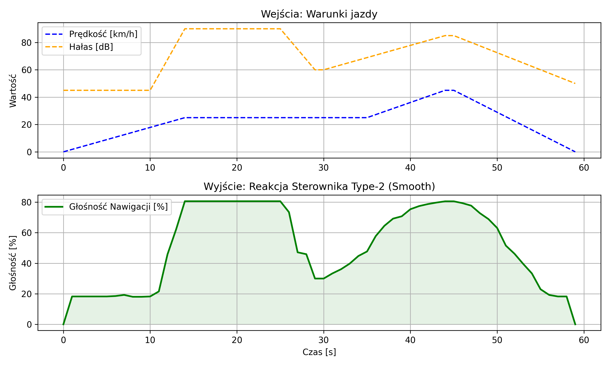
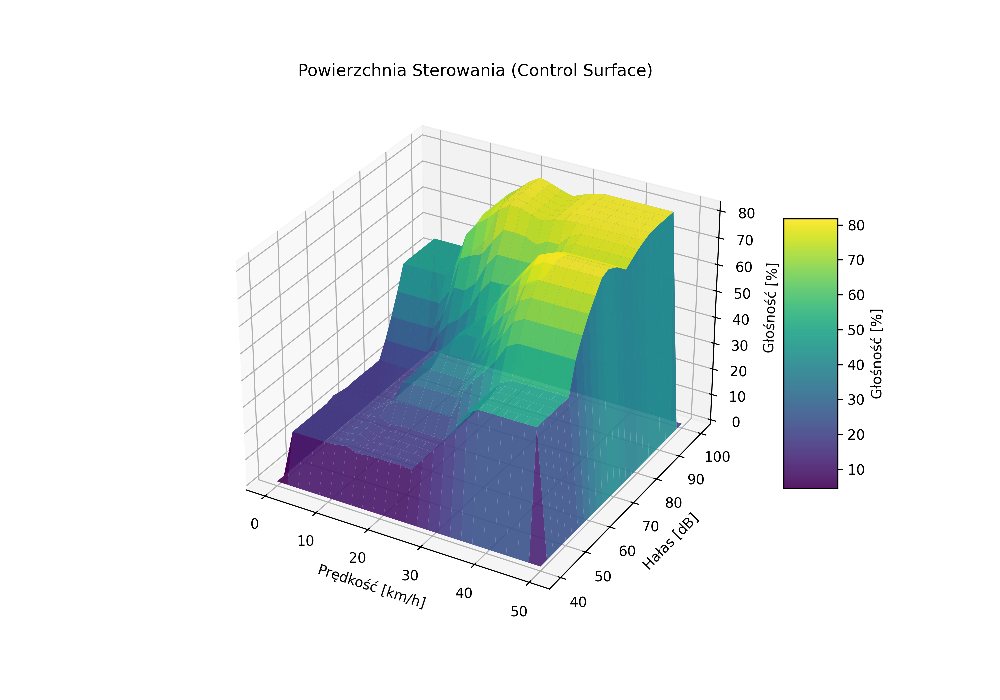
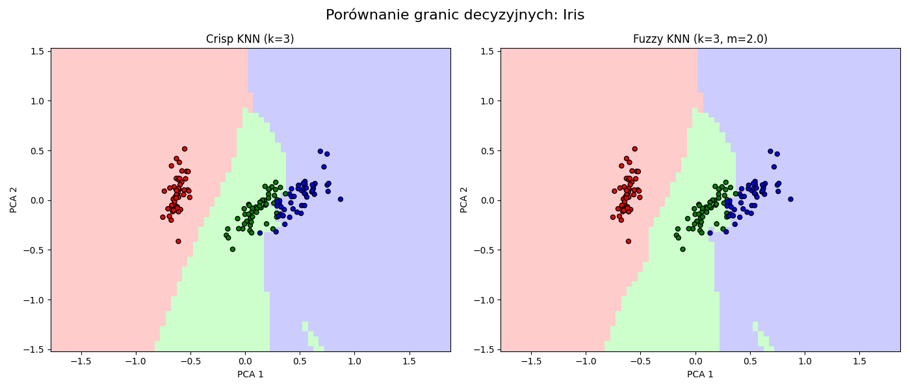
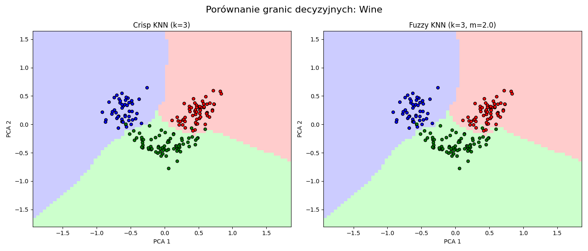
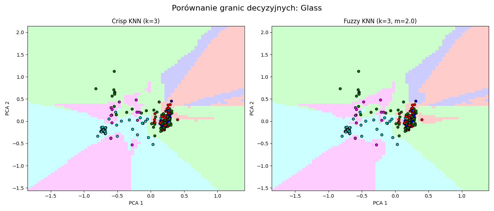

<script type="text/javascript" src="https://cdnjs.cloudflare.com/ajax/libs/mathjax/2.7.7/MathJax.js?config=TeX-MML-AM_CHTML"></script>
<script type="text/x-mathjax-config">
MathJax.Hub.Config({
  tex2jax: {inlineMath: [['$','$'], ['\\(','\\)']]}
});
</script>

# Systemy rozmyte

Sterowanie głośnością nawigacji w zależności od szumu.
```
Oleksii Nawrocki
Tomasz Nowak
```

Porównanie algorytmu sztucznej inteligencji k-NN oraz Fuzzy k-NN.
```
Dawid Bar
Dominik Dziadosz
Julia Chmura
```

# Część I: Adaptacyjny system sterowania głośnością nawigacji (Interval Type-2 Fuzzy Logic)

### 1. Wstęp i Cel Projektu

Celem projektu jest zaprojektowanie i zaimplementowanie inteligentnego systemu sterowania głośnością komunikatów nawigacji dla roweru elektrycznego/miejskiego. W warunkach ruchu drogowego rowerzysta narażony jest na silnie zmienne warunki akustyczne. Przy dużych prędkościach dominuje szum wiatru, natomiast podczas postoju (np. na światłach) istotny staje się hałas otoczenia lub, przeciwnie, cisza osiedlowa.

Manualna regulacja głośności podczas jazdy odrywa uwagę i ręce od kierownicy, co stwarza bezpośrednie zagrożenie bezpieczeństwa. Klasyczne systemy sterowania (np. liniowe podgłaśnianie w funkcji prędkości) okazują się niewystarczające w sytuacjach nietypowych, takich jak wolna jazda w głośnym korku ulicznym. Z tego względu zaproponowano system adaptacyjny oparty na logice rozmytej, który automatycznie dostosowuje poziom dźwięku, zapewniając słyszalność komunikatów bez generowania "hałasu akustycznego" dla otoczenia.

### 2. Zastosowanie Uogólnień Zbiorów Rozmytych (Teoria)

Tradycyjne zbiory rozmyte typu pierwszego (Type-1 Fuzzy Sets) charakteryzują się precyzyjnie zdefiniowanymi funkcjami przynależności, gdzie dla każdego elementu $x$ przypisana jest jedna, konkretna wartość stopnia przynależności $\mu(x) \in [0, 1]$. W rzeczywistych systemach sterowania, takich jak adaptacja głośności w ruchu ulicznym, często mamy do czynienia z niepewnością, której zbiory typu pierwszego nie są w stanie w pełni zamodelować. Źródłami tej niepewności mogą być szumy pomiarowe czujników (np. mikrofonu owiewanego wiatrem) lub subiektywność w definiowaniu pojęć lingwistycznych (np. granica między "cicho" a "umiarkowanie").

Aby rozwiązać ten problem, w projekcie zastosowano **Logikę Rozmytą Typu 2 (Interval Type-2 Fuzzy Logic System - IT2FLS)**.

#### 2.1. Interval Type-2 Fuzzy Sets i Footprint of Uncertainty (FOU)

Zbiór rozmyty typu 2 można interpretować jako zbiór, którego funkcja przynależności jest sama w sobie rozmyta. W przypadku interwałowym (Interval Type-2), stopień przynależności dla danego wejścia nie jest pojedynczą liczbą, lecz przedziałem wartości.

Kluczowym pojęciem jest tutaj **Ślad Niepewności (Footprint of Uncertainty - FOU)**. FOU to obszar ograniczony przez dwie funkcje przynależności typu 1:
*   **Górna Funkcja Przynależności (Upper Membership Function - UMF),** oznaczana jako $\bar{\mu}(x)$,
*   **Dolna Funkcja Przynależności (Lower Membership Function - LMF),** oznaczana jako $\underline{\mu}(x)$.

Dla każdego argumentu $x$, stopień przynależności jest przedziałem:
$$ \mu_{\tilde{A}}(x) = [\underline{\mu}(x), \bar{\mu}(x)] $$

Obszar FOU reprezentuje całą niepewność zawartą w definicji zbioru. Im szerszy FOU, tym większa tolerancja systemu na niedokładności danych wejściowych.

#### 2.2. Uzasadnienie Matematyczne i Praktyczne

Zastosowanie uogólnień w postaci IT2FLS w sterowniku głośności wynika z następujących przesłanek:

1.  **Modelowanie szumu:** W warunkach jazdy rowerem odczyt poziomu hałasu (dB) jest silnie zaszumiony (np. porywy wiatru). W logice typu 1, chwilowa zmiana wartości wejściowej mogłaby spowodować nagłe przełączenie reguły. W logice typu 2, dzięki FOU, małe fluktuacje mieszczą się wewnątrz "grubości" funkcji przynależności, co stabilizuje wyjście sterownika.
2.  **Gładkość powierzchni sterowania:** Systemy IT2FLS generują zazwyczaj gładsze powierzchnie sterowania w okolicach przełączeń reguł niż systemy typu 1. Wynika to z procesu redukcji typu (Type-Reduction), który uśrednia wnioskowanie z górnych i dolnych funkcji przynależności.
3.  **Robustness (Odporność):** Matematycznie udowodniono, że systemy IT2FLS potrafią aproksymować złożone funkcje sterowania przy mniejszej liczbie reguł niż systemy typu 1, zachowując przy tym większą odporność na błędy modelowania.

W kontekście projektu, użycie IT2FLS pozwala na uniknięcie zjawiska "skakania" głośności przy niestabilnych odczytach z mikrofonu, co bezpośrednio przekłada się na komfort i bezpieczeństwo użytkownika.

### 3. Projekt Systemu Sterowania

#### 3.1. Zmienne Lingwistyczne

System operuje na dwóch zmiennych wejściowych i jednej wyjściowej. Zakresy (Universum) dobrano na podstawie typowej charakterystyki jazdy rowerem miejskim oraz parametrów akustycznych.

##### Wejście 1: Prędkość (Speed)
- **Zakres:** 0 – 50 km/h
- **Termy** (Zbiory):
  1. `Low` (Wolna jazda / Manewrowanie / Postój)
  2. `Medium` (Typowa prędkość podróżna)
  3. `High` (Szybka jazda / Zjazd)

##### Wejście 2: Hałas (Noise)
- **Zakres**: 40 – 100 dB
- **Termy** (Zbiory):
  1. `Quiet` (Cicha ulica / Park)
  2. `Moderate` (Umiarkowany ruch miejski)
  3. `Loud` (Duży ruch / Silny wiatr / Ciężarówki)

##### Wyjście: Głośność Nawigacji (Volume)
- **Zakres**: 0 – 100 % (Wysterowanie głośnika)
- **Termy** (Zbiory): 
  1. `Low`
  2. `Medium`
  3. `High`

#### 3.2. Funkcje Przynależności i Optymalizacja Systemu (Tuning)

Kluczowym aspektem projektu było dobranie odpowiedniego kształtu funkcji przynależności. Wstępne testy z wykorzystaniem funkcji trójkątnych dla wartości środkowych (Medium) wykazały niestabilność sterowania – w punktach przejściowych między regułami następowały gwałtowne spadki wartości sterującej (tzw. oscylacje lub "rogi" na charakterystyce).

Aby wyeliminować ten problem i zapewnić wymaganą płynność sterowania (Smooth Control), w finalnym rozwiązaniu zastosowano funkcje trapezowe (Trapezoidal Membership Functions) dla wszystkich zbiorów rozmytych. Trapezoidalny kształt zapewnia szersze jądro (obszar o przynależności 1.0), co stabilizuje odpowiedź układu przy niewielkich fluktuacjach wejścia. Dodatkowo, wykorzystując właściwości Interval Type-2 Fuzzy Logic, zwiększono stopień nakładania się (overlap) Dolnych Funkcji Przynależności (LMF). Zabieg ten wyeliminował martwe strefy, w których sterownik traciłby pewność decyzyjną.

#### 3.3. Baza Reguł (FAM)

Zdefiniowano kompletną bazę 9 reguł wnioskowania typu Mamdani:

| **Prędkość \ Hałas** | **Quiet** | **Moderate** | **Loud** |
|----------------------|-----------|--------------|----------|
| **Low**              | Low       | Low          | Medium   |
| **Medium**           | Low       | Medium       | High     |
| **High**             | Medium    | High         | High     |

### 4. Analiza Empiryczna i Wyniki

Zgodnie z wymaganiami projektowymi (ocena adekwatności rozwiązania), przeprowadzono weryfikację działania sterownika poprzez symulację dynamiczną oraz analizę powierzchni sterowania.

#### 4.1. Symulacja Scenariusza Drogowego

Wygenerowano scenariusz testowy o czasie trwania 60 sekund, odwzorowujący rzeczywisty przejazd. Scenariusz obejmuje: ruszanie z miejsca, nagły incydent akustyczny przy stałej prędkości (np. przejazd pojazdu uprzywilejowanego) oraz jazdę z dużą prędkością.


Rys. 1. Przebieg zmiennych wejściowych (góra) oraz odpowiedź sterownika (dół) w czasie.

**Analiza wyników symulacji:**
Na podstawie wykresu (Rys. 1) można stwierdzić poprawność działania algorytmu:

W przedziale 10s – 20s (linia pomarańczowa) następuje gwałtowny wzrost hałasu przy zachowaniu stałej prędkości. System reaguje natychmiastowym podniesieniem głośności (linia zielona) do poziomu ok. 80%, co gwarantuje przebicie się komunikatu przez hałas tła.

Charakterystyka zmian jest płynna. Nie występują niepożądane skoki typu "włącz/wyłącz", które mogłyby dezorientować użytkownika. Jest to efekt zastosowania logiki rozmytej, która interpoluje wynik pomiędzy regułami.

#### 4.2. Charakterystyka Powierzchniowa (Control Surface)

W celu zbadania globalnej spójności reguł i braku uchybień w logice, wygenerowano trójwymiarową powierzchnię sterowania układu.


Rys. 2. Powierzchnia sterowania (Control Surface) dla układu Interval Type-2.

**Wnioski:**
Wygenerowana powierzchnia sterowania wykazuje cechę monotoniczności oraz gładkości. Nie występują lokalne minima (tzw. "dziury" w sterowaniu), gdzie głośność spadałaby mimo wzrostu parametrów wejściowych. "Płaskowyże" (płaskie obszary na wykresie) wskazują na stabilność systemu w stanach ustalonych, co jest bezpośrednią zasługą zastosowania szerokiego obszaru niepewności (FOU) w logice Type-2.

### 5. Podsumowanie

Zaprojektowany adaptacyjny układ sterowania głośnością spełnia założenia projektowe. Część praktyczna wykazała, że zastosowanie uogólnień teorii zbiorów rozmytych (Interval Type-2 Fuzzy Logic) pozwoliło na stworzenie systemu odpornego na szum pomiarowy i zapewniającego wyższą kulturę pracy niż klasyczne rozwiązania progowe. Otrzymane wyniki empiryczne (symulacja i powierzchnia sterowania) jednoznacznie potwierdzają adekwatność i stabilność zaproponowanego rozwiązania.

# Część II: Teoretyczny opis różnić algorytmów kNN oraz Fuzzy kNN
### 1. Wstęp
Zaimplementowany system opiera się na podejściu tzw. uczenia leniwego (ang. lazy learning). Oznacza to, że system nie tworzy abstrakcyjnego modelu (np. drzewa decyzyjnego czy sieci neuronowej) podczas fazy treningu. Zamiast tego, zapamiętuje on cały zbiór danych treningowych.

Prawdziwa praca (obliczenia) rozpoczyna się dopiero w momencie, gdy system otrzymuje nowy, nieznany obiekt i musi zdecydować, do jakiej kategorii on należy. Decyzja podejmowana jest na podstawie analizy obiektów, które w przestrzeni cech znajdują się najbliżej badanego punktu.


### 2. Standardowy algorytm K-NN

Wersja klasyczna (Crisp kNN) opiera się na tzw. twardej decyzji.
Główną cechą jest że ten system zakłada, że ilość znaczy jakość. Jeśli wokół danego obiektu jest więcej punktów klasy A, to prawdopodobnie ten obiekt również należy do klasy A, niezależnie od dokładnego rozmieszczenia tych punktów.

Jako miarę podobieństwa między badaną próbką x a próbką treningową xj wykorzystano odległość Euklidesową.

### 2.1 Działanie algorytmu
Gdy system otrzymuje nowy obiekt do sklasyfikowania:

* Skanowanie przestrzeni: Algorytm przegląda wszystkie zapamiętane punkty ze zbioru treningowego i mierzy odległość (w linii prostej) od nowego obiektu do każdego z nich.
* Wybór sąsiedztwa: Spośród wszystkich punktów wybierana jest określona liczba (k) tych, które znajdują się fizycznie najbliżej.
* Twarde głosowanie: Każdy z wybranych sąsiadów oddaje głos na swoją własną klasę. W tym podejściu głos każdego sąsiada jest równy. Nie ma znaczenia, czy sąsiad jest tuż obok, czy znajduje się na granicy zasięgu – jego głos liczy się jako "1".
* Decyzja: Nowy obiekt zostaje przypisany do tej kategorii, która zebrała najwięcej głosów. W przypadku remisu decyduje zazwyczaj kolejność znalezienia sąsiadów.

### 3. Algorytm rozmyty (Fuzzy kNN)
Algorytm Fuzzy k-NN stanowi rozszerzenie klasycznego podejścia k-NN o elementy logiki rozmytej. W przeciwieństwie do wersji Crisp, algorytm ten nie podejmuje decyzji zero-jedynkowej, lecz opisuje przynależność obiektu do każdej klasy w sposób ciągły, za pomocą wektora przynależności.

Zamiast stwierdzenia, że obiekt należy lub nie należy do danej klasy, Fuzzy k-NN określa w jakim stopniu obiekt należy do poszczególnych klas. Suma wszystkich stopni przynależności wynosi 1, co umożliwia interpretację ich jako rozkładu pewności.

Kluczowym elementem algorytmu jest uwzględnienie odległości sąsiadów. Im bliżej znajduje się dany sąsiad, tym większy wpływ ma on na końcową decyzję. Stopień tego wpływu kontrolowany jest przez parametr rozmycia m (m > 1), który decyduje o tym, jak silnie algorytm różnicuje bliskich i dalszych sąsiadów.

### 3.1 Działanie algorytmu
Proces klasyfikacji nowego obiektu w algorytmie Fuzzy k-NN przebiega następująco:

* Obliczenie odległości: Podobnie jak w wersji klasycznej, obliczana jest odległość euklidesowa pomiędzy nowym obiektem a wszystkimi punktami zbioru treningowego.
* Wybór k sąsiadów: Spośród wszystkich punktów wybieranych jest k najbliższych sąsiadów.
* Wyznaczenie wag: Dla każdego sąsiada obliczana jest waga zależna od odległości. Wagi są odwrotnie proporcjonalne do odległości (z uwzględnieniem parametru m), co sprawia, że bliższe punkty mają znacznie większy wpływ na wynik.
* Agregacja przynależności: Wagi są sumowane osobno dla każdej klasy, tworząc wektor przynależności.
* Normalizacja: Wektor przynależności jest normalizowany tak, aby suma jego elementów wynosiła 1.
* Decyzja końcowa: Jeśli wymagane jest przypisanie „twardej” klasy, wybierana jest klasa o najwyższym stopniu przynależności (argmax).

Dodatkowo, w przypadku idealnego dopasowania (odległość równa zero), algorytm przypisuje obiektowi pełną przynależność do klasy identycznej próbki treningowej, eliminując ryzyko niestabilności numerycznej.

### 4. Porównanie obu algorytmów

### 4.1 Wiarygodność danych
W wersji klasycznej (Crisp) istnieje ryzyko błędu, jeśli wśród najbliższych sąsiadów znajdą się tzw. punkty odstające (szum). Wyobraź sobie sytuację, gdzie badany punkt jest bardzo blisko jednego punktu klasy A, ale nieco dalej otaczają go trzy punkty klasy B. Wersja klasyczna wybierze klasę B (bo 3 głosy przeciw 1), mimo że punkt A jest znacznie bliżej i bardziej wiarygodny.

W algorytmie Fuzzy k-NN problem ten jest w dużej mierze ograniczony. Dzięki zastosowaniu wag zależnych od odległości, bliższy sąsiad ma znacznie większy wpływ na wynik niż dalsze punkty. W opisanej sytuacji punkt klasy A, znajdujący się bardzo blisko badanego obiektu, otrzyma wysoką wagę, co może przeważyć nad większą liczbą dalszych sąsiadów klasy B. Dzięki temu algorytm jest bardziej odporny na szum i obserwacje odstające.

### 4.2 Niejednoznaczność
W wersji klasycznej często zdarzają się sytuacje sporne (np. 2 głosy na TAK, 2 głosy na NIE). Algorytm musi wtedy wybierać lub brać pierwszy wynik z brzegu.

Fuzzy k-NN naturalnie radzi sobie z takimi przypadkami, ponieważ nie wymusza jednoznacznej decyzji na wczesnym etapie. Zamiast tego zwraca stopnie przynależności do wszystkich klas, co pozwala:

* ocenić poziom niepewności klasyfikacji,
* wykryć obiekty leżące na granicach klas,
* wykorzystać wyniki w dalszych etapach systemu decyzyjnego.

Dopiero na końcu, jeśli jest to konieczne, można dokonać twardej decyzji, wybierając klasę o największej przynależności, zachowując jednocześnie informację o alternatywnych możliwościach.

## 5 Analiza Wyników

W ramach eksperymentu przeprowadzono testy porównawcze dwóch klasyfikatorów: klasycznego **Crisp k-NN** oraz rozmytego **Fuzzy k-NN**. Oba algorytmy uruchomiono z parametrem sąsiedztwa $k=3$ (oraz $m=2.0$ dla wersji rozmytej) na zbiorach danych poddanych wcześniej normalizacji Min-Max. W celu wizualizacji granic decyzyjnych zastosowano redukcję wymiarowości metodą PCA (Principal Component Analysis).


### 5.1 Zbiór Iris (Łatwa separowalność)

Wyniki liczbowe:

**Dokładność Crisp:** 93.33%

**Dokładność Fuzzy:** 93.33%

**Macierz pomyłek Crisp:**
```
[[15  0  0]
 [ 0 15  0]
 [ 0  3 12]]
```

**Macierz pomyłek Fuzzy:**
```
[[15  0  0]
 [ 0 15  0]
 [ 0  3 12]]
```
**Wizualizacja:**



**Analiza wizualna:** Wizualizacja PCA (Rys. 1) pokazuje, że klasy w zbiorze Iris są bardzo dobrze odseparowane (szczególnie klasa Setosa). Granice między klasami Versicolor i Virginica są stosunkowo wyraźne.

**Wniosek:** W przypadku danych liniowo separowalnych lub o bardzo małym poziomie szumu, narzut obliczeniowy logiki rozmytej nie przynosi wymiernych korzyści. Algorytm klasyczny radzi sobie tutaj doskonale, a wersja rozmyta osiąga identyczny wynik, de facto redukując się do działania klasycznego (ponieważ wagi dla bliskich sąsiadów dążą do 1, a punkty błędnie sklasyfikowane leżały zbyt głęboko w obszarze innej klasy, by wagi mogły zmienić decyzję).

### 5.2 Zbiór Wine (Średnia złożoność)

Wyniki liczbowe:

**Dokładność Crisp:** 94.44%

**Dokładność Fuzzy:** 94.44%

**Macierz pomyłek Crisp:**
```
[[18  0  0]
 [ 1 18  2]
 [ 0  0 15]]
```
**Macierz pomyłek Fuzzy:**
```
[[18  0  0]
 [ 1 18  2]
 [ 0  0 15]]
```

**Wizualizacja:**



**Analiza wizualna:** Zbiór Wine charakteryzuje się większą liczbą wymiarów (13 cech). Po rzutowaniu do 2D widać, że strefy przynależności do klas są bardziej zwarte, ale granice są nieregularne.

**Wniosek:** Mimo że teoretycznie Fuzzy k-NN wygładza granice decyzyjne, w tym konkretnym podziale danych (train/test split) oba modele zachowały się identycznie. Błędy wystąpiły w klasie środkowej, która została pomylona z klasami sąsiednimi. Wskazuje to, że w zbiorze testowym nie znalazły się próbki "remisowe" lub leżące w takiej odległości od sąsiadów, gdzie wagi $1/d^2$ przeważyłyby nad prostym głosowaniem większościowym.
### 5.3 Zbiór Glass (Trudna separowalność, wysoki szum)

Wyniki liczbowe:

**Dokładność Crisp:** 70.77%

**Dokładność Fuzzy:** 72.31% (+1.54 p.p.)

**Macierz pomyłek Crisp:**
```
[[15  5  1  0  0  0]
 [ 2 19  1  0  1  0]
 [ 3  1  1  0  0  0]
 [ 0  1  0  1  0  2]  <-- Klasa 4 (indeks 3): 1 trafienie
 [ 0  0  0  0  2  1]
 [ 0  1  0  0  0  8]]
```

**Macierz pomyłek Fuzzy:**
``` 
[[15  5  1  0  0  0]
 [ 2 19  1  0  1  0]
 [ 3  1  1  0  0  0]
 [ 0  0  0  2  0  2]  <-- Klasa 4 (indeks 3): 2 trafienia (Poprawa!)
 [ 0  0  0  0  2  1]
 [ 0  1  0  0  0  8]]
```
**Wizualizacja:**



**Analiza wizualna:** Jest to najtrudniejszy z badanych zbiorów. Klasy chemiczne szkła nakładają się na siebie (overlapping), a dane zawierają punkty odstające (outliers).

**Wniosek:** To tutaj ujawnia się przewaga podejścia rozmytego. Model Fuzzy osiągnął wyższą dokładność (72.31% vs 70.77%), poprawnie klasyfikując dodatkową próbkę w trudnej klasie (widoczna poprawa w 4. wierszu macierzy). Wynika to z dwóch czynników
1) Odporność na szum: W klasycznym k-NN pojedynczy punkt szumu (outlier) znajdujący się blisko granicy innej klasy może „przegłosować” wynik, tworząc błędną wyspę decyzyjną.
2) Wagi odległości: W Fuzzy k-NN, nawet jeśli $k=3$ sąsiadów jest z różnych klas (np. dwa z klasy A i jeden z klasy B), ale ten jeden z klasy B jest bardzo blisko badanej próbki (mały dystans euklidesowy), otrzyma on znacznie większą wagę ($w \approx 1/d^2$). Pozwala to na poprawną klasyfikację w gęstych, zachodzących na siebie obszarach.

## 5.4 Podsumowanie i wnioski 

Na podstawie przeprowadzonych badań sformułowano następujące wnioski dotyczące wyższości systemów rozmytych nad klasycznymi (Crisp) w zadaniach klasyfikacji:

1) **Niejednoznaczność danych (Ambiguity):** Gdy granice między klasami nie są ostre (jak w zbiorze Glass), logika rozmyta pozwala modelować niepewność. Zamiast binarnej decyzji, system analizuje stopień przynależności, co jest bliższe rzeczywistej naturze zjawisk w świecie fizycznym.
2) **Problem remisów i małego K:** Wersja Crisp przy małym $k$ jest podatna na losowe rozstrzyganie remisów. W Fuzzy k-NN o wyniku decyduje precyzyjna suma wag, co pozwoliło na uzyskanie lepszego wyniku w najtrudniejszym zbiorze danych (Glass).
3) **Wiarygodność decyzji (Confidence Level):** Choć w tym badaniu mierzono accuracy (które jest metryką typu Crisp), największą zaletą Fuzzy k-NN jest informacja zwrotna.
   - **Crisp:** Zwraca: „To jest klasa A”.
   - **Fuzzy:** Zwraca wektor: „85% szans na klasę A, 15% na klasę B”.W systemach krytycznych (np. medycyna, sterowanie) taka informacja jest kluczowa – pozwala systemowi wstrzymać się od decyzji, gdy pewność (membership) jest niska dla wszystkich klas.

Wersja rozmyta (Fuzzy) zyskuje przewagę nad wersją klasyczną (Crisp) w środowiskach zaszumionych, przy nakładających się klasach oraz tam, gdzie kluczowa jest informacja o stopniu pewności klasyfikacji, a nie tylko sama etykieta końcowa.
